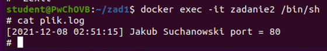

# Laboratorium Programowania w chmurach obliczeniowych- sprawozdanie 
## Zadanie 1
Do pierwszego zadania użyty został język php. Kod znajduje się w załączonym pliku index.php.
## Zadanie 2
Plik Dockerfile został dołączony do sprawozdania.  

Potwierdzenie poprawnego zbudowania pliku

Potwierdzenie uruchomienia kontenera

Utworzony obraz

Wyświetlenie informacji z podpunktu B zawartego w 1 zadaniu 

## Zadanie 3
Należy podać polecenia niezbędne do:

a.	zbudowania opracowanego obrazu kontenera

docker build  - - tag zad2 

b.	uruchomienia kontenera na podstawie zbudowanego obrazu,

docker run -p 80:80 -d --name zadanie2 zad2

c.	sposobu uzyskania informacji, które wygenerował serwer w trakcie uruchamiana kontenera (patrz: punkt 1a)

docker exec -it zadanie2 /bin/sh

cat plik.log

d.	sprawdzenia, ile warstw posiada zbudowany obraz.

docker history zadanie2

## Zadanie 4
Aby automatycznie przenieść stworzony obraz na konto na DockerHub należy połączyć konto z tym na GitHubie. Jest to opcja płatna.

